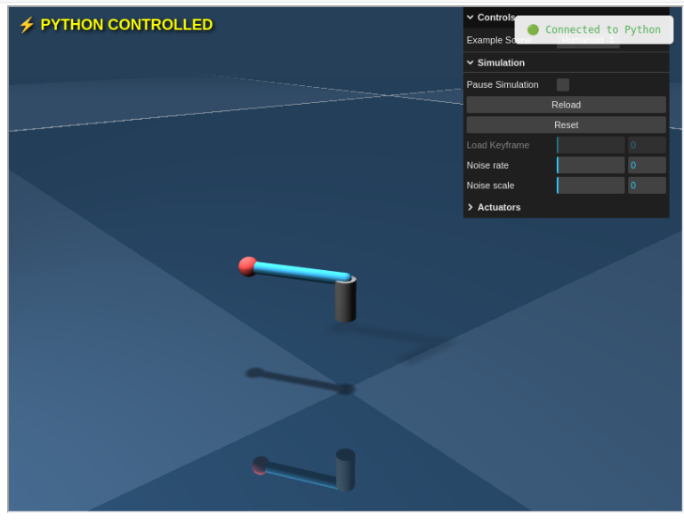

# Net MuJoCo

A web-based visualization tool for MuJoCo physics simulations. View and control your MuJoCo models remotely through a **browser**, perfect for SSH sessions or remote development. Check **jupyter_demo.ipynb** for how to view mujoco from jupyter notebook.

<p align="center">
  
</p>

## Quick Start

### 1. In your venv, install this project:
```bash
pip install https://github.com/yblei/net_mujoco/releases/latest/download/net_mujoco-0.0.1-py3-none-any.whl
```


### 2. Integrate into your code

Replace your standard MuJoCo passive viewer with the network viewer:

```python
import mujoco
from net_mujoco import launch_passive

# Load your model
full_path = "path/to/your/model.xml"
model = mujoco.MjModel.from_xml_path(full_path)
data = mujoco.MjData(model)

# Launch the network viewer (opens browser automatically at localhost:9001)
with launch_passive(m, d, model_path=full_path) as viewer:
    # Your simulation loop
    while True:
        mujoco.mj_step(model, data)
        viewer.sync()
```

## How It Works

1. **Python side**: `launch_passive()` starts a local HTTP server with WebSocket support and serves the frontend
2. **Browser side**: Frontend loads at `http://localhost:9001/` and connects to WebSocket at `/ws`
3. **Real-time sync**: Simulation state updates stream from Python to browser via WebSocket

## Development

### Local Testing

```bash
# The frontend is now served automatically by the Python server
# Just run your simulation
python launch_passive_demo.py
```

### Building

Install the frontend dependencies and build the wasm bundle with:

```bash
make install_npm
```

### Make a Release

```bash
make build_wheel
```


## License

This project uses MuJoCo WASM which is licensed under the Apache License 2.0.

## Acknowledgments

- Built on [MuJoCo](https://mujoco.org/) physics engine
- Based on the official [MuJoCo WASM](https://github.com/zalo/mujoco_wasm)
